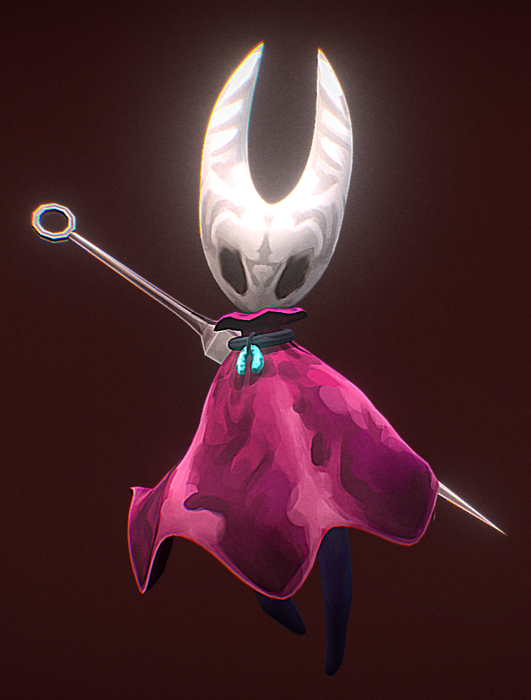
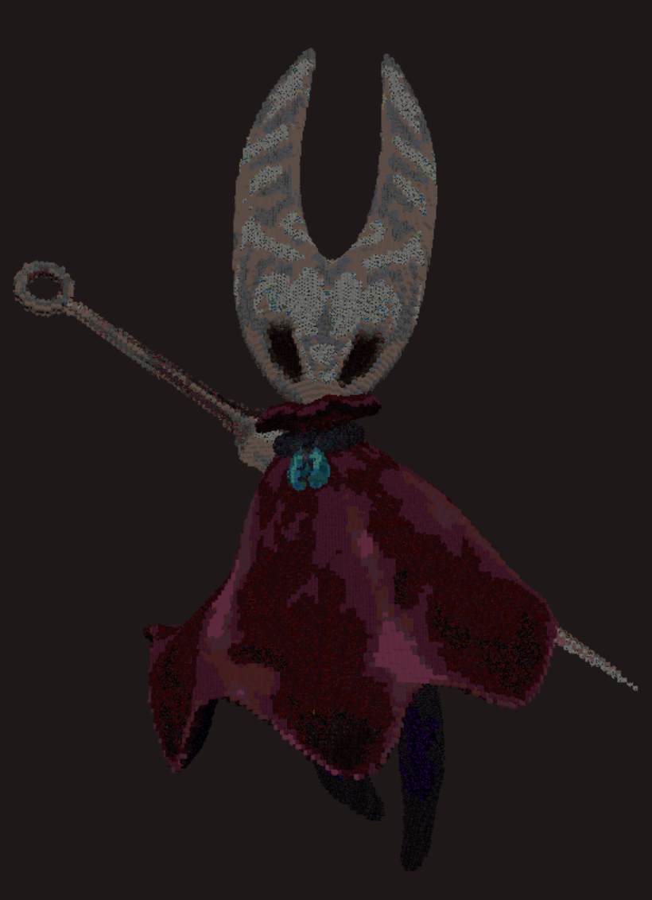
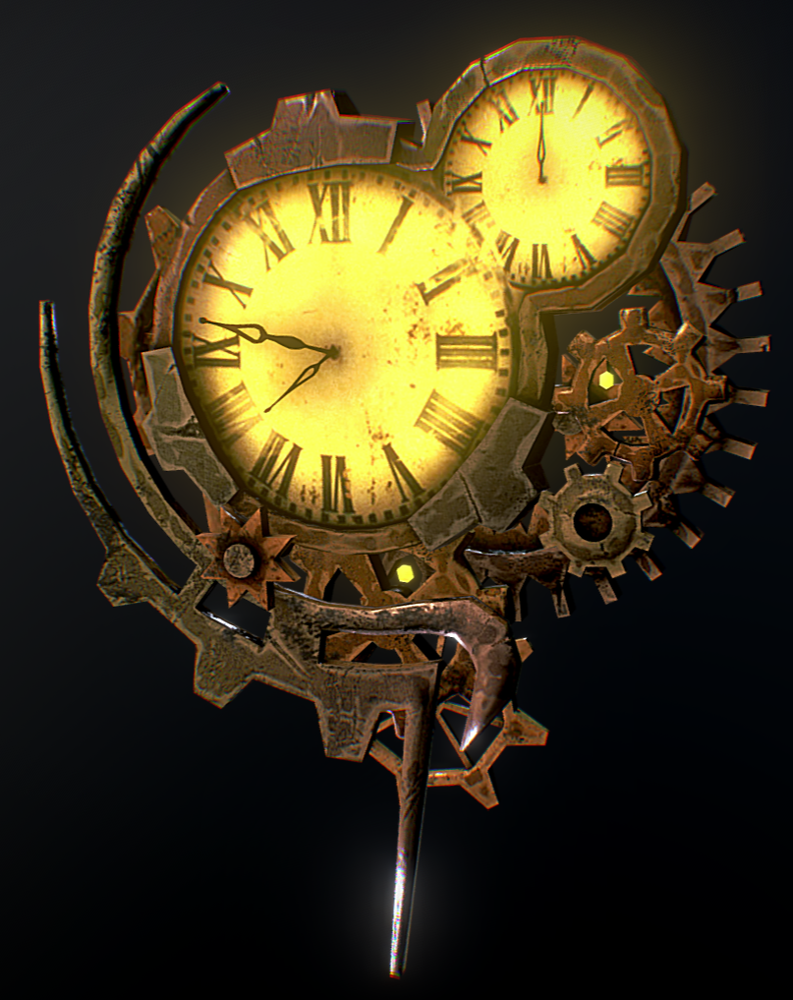
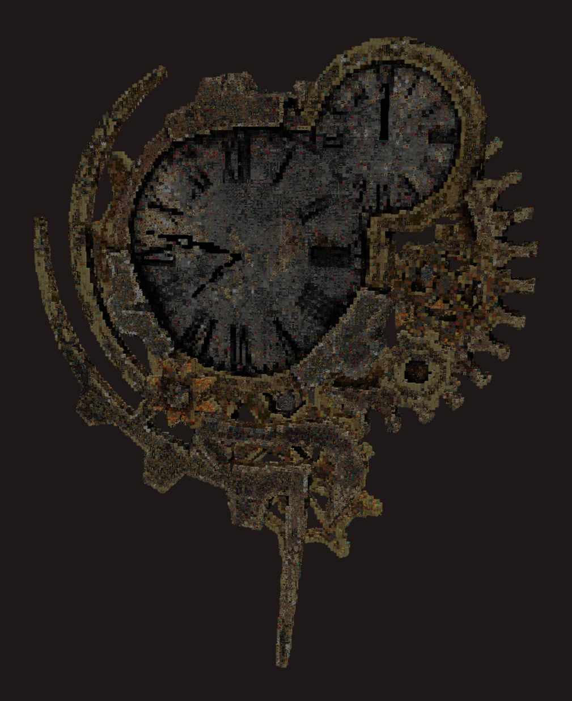
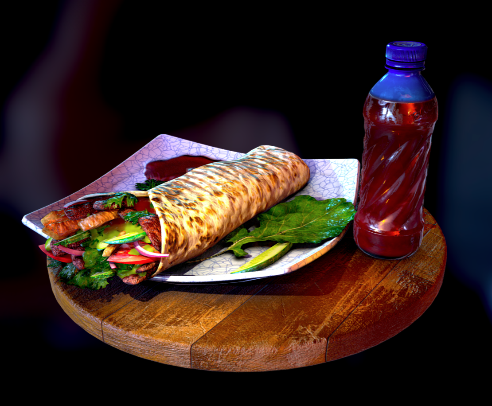
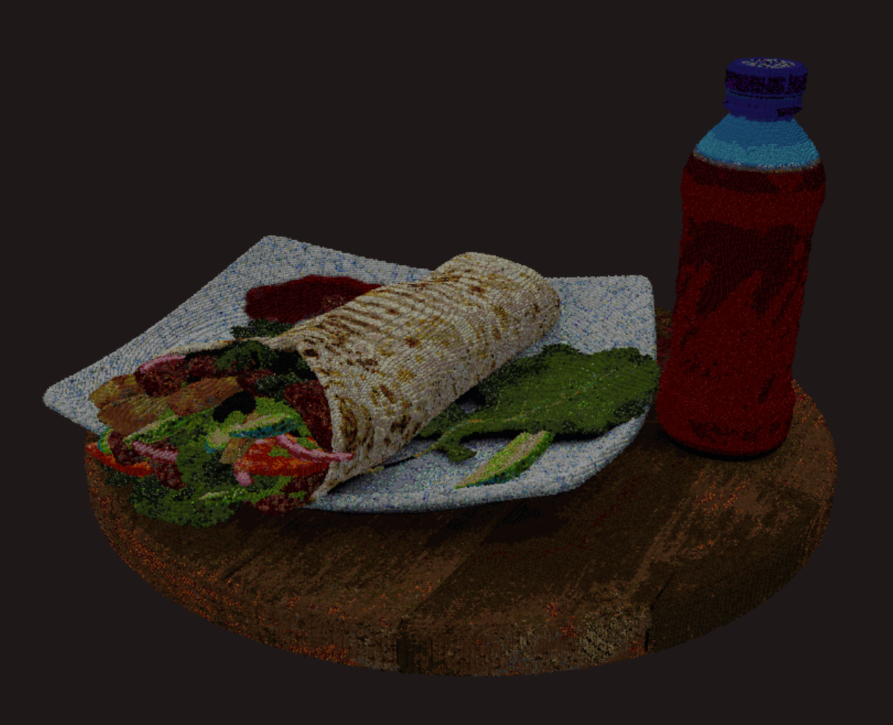
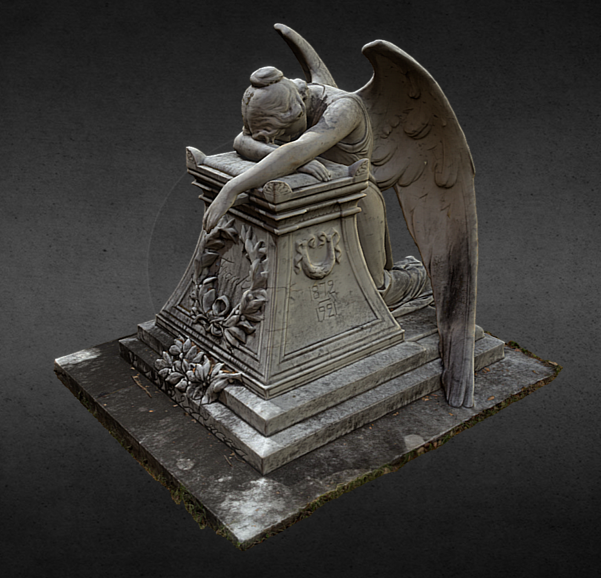
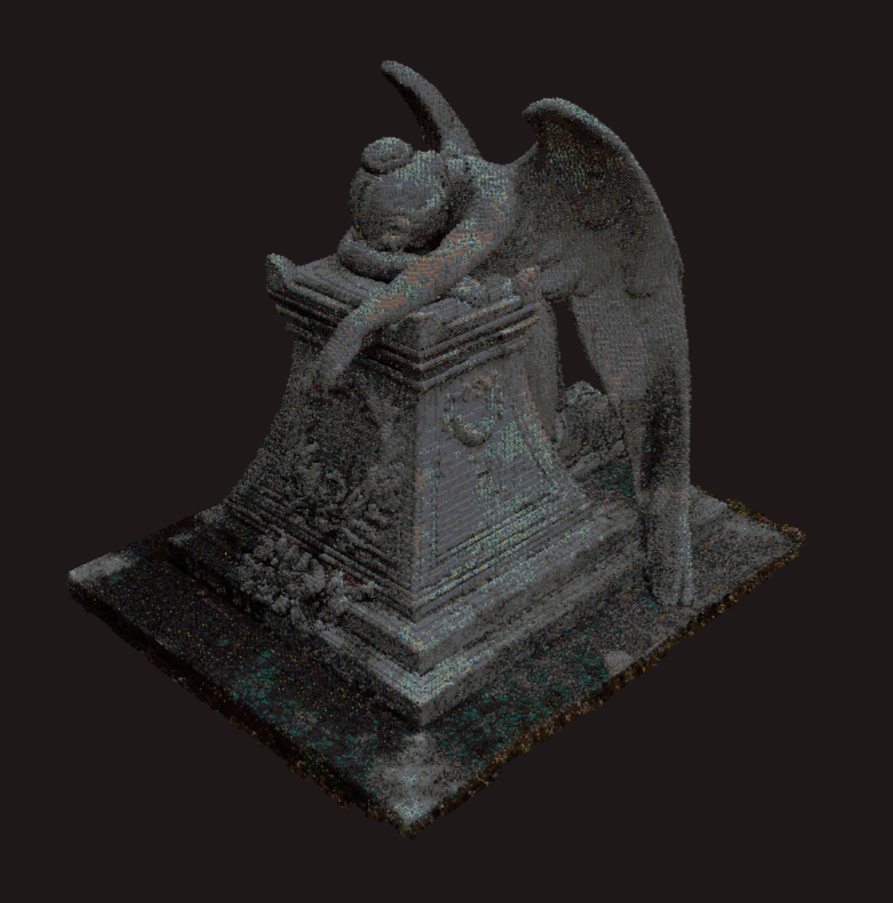

# Colorify 7

[English](README.md) | **简体中文**

Colorify 7 是一个面向 Minecraft: Bedrock Edition 的开源工具，可将图像与三维模型转换为游戏内内容。它支持粒子艺术、像素艺术与物体体素化，结果可导出为 `mcfunction`、`mcstructure` 或 `mcaddon` 文件，也可通过本地 WebSocket 服务器直接实时传输到正在运行的游戏会话中。

本应用基于 [Tauri 2](https://tauri.app/) 与 [React](https://react.dev/) 构建，支持 Windows 与 Android 平台。

## 目录

- [功能特性](#功能特性)
- [平台支持](#平台支持)
- [快速开始](#快速开始)
- [使用方法](#使用方法)
- [致谢](#致谢)
- [许可证](#许可证)

## 功能特性

### 粒子艺术（Particle Art）

将图像转换为游戏内的粒子展示。颜色可匹配至一组可配置的粒子映射，也可按像素输出为彩色粒子（后者需要 Minecraft 1.20.80 或更高版本，并会自动打包为资源包）。结果可打包为 `.mcaddon` 文件，或通过 WebSocket 传输到游戏。

### 像素艺术（Pixel Art）

将图像压平为单平面方块布局，或生成阶梯式像素艺术。支持可配置的色距度量、有序抖动、调色板限制（仅地毯、仅羊毛）以及玻璃、沙子与粉末方块的排除。导出为 `mcfunction` 或 `.mcstructure` 文件。

### Obj 转体素（Obj to Voxel）

将 `OBJ`、`GLB` 与 `GLTF` 模型体素化为实心或空心 Minecraft 建筑。管线采用自定义的 BVH 加速光线投射体素化器，支持分辨率、旋转、抖动与多重采样着色等配置。导出为 `.mcstructure` 文件。

### WebSocket 实时传输

运行一个本地 WebSocket 服务器，将生成的方块指令实时推送到已连接的基岩版客户端，可在建造过程中即时观察结果。服务器会报告任务进度，并将游戏消息转发回应用。

## 平台支持

| 平台    | 状态 |
| ------- | ---- |
| Windows | 支持 |
| Android | 支持 |

## 快速开始

### 环境要求

- [Node.js](https://nodejs.org/) 20 或更高版本
- [pnpm](https://pnpm.io/)
- [Rust](https://www.rust-lang.org/)（stable 工具链）
- [Tauri 2](https://tauri.app/start/prerequisites/) 的平台依赖——在 Windows 上为 Microsoft Visual C++ Build Tools 与 WebView2 运行时

### 从源码运行

```bash
pnpm install
pnpm tauri dev
```

### 构建发布版本

```bash
pnpm build        # 编译前端（TypeScript + Vite）
pnpm tauri build  # 生成平台安装包
```

## 使用方法

1. 选择模式：粒子艺术、像素艺术、Obj 转体素或 WebSocket。
2. 载入图像或三维模型。
3. 调整生成参数（分辨率、旋转、调色板、抖动等）。
4. 将结果导出为文件，或通过 WebSocket 服务器发送到游戏。

实时传输到游戏：

- 在 Minecraft 设置中启用 "Enable WebSocket"，并关闭 "WebSocket Requires Encryption"。
- 在 Windows 上，需先启用 UWP 回环豁免，游戏才能访问本地服务器。
- 使用 `/connect 127.0.0.1:<port>` 连接。

## 画廊

<table>
    <tr>
        <td colspan=2><a href="https://skfb.ly/pK9UV">"Hornet - Hollow Knight - Handpainted" by TonXx</a></td>
    </tr>
    <tr>
        <td></td>
        <td></td>
    </tr>
    <tr>
        <td colspan=2><a href="https://skfb.ly/pK9UV">"Broken Steampunk Clock" by VassKacsoHunor</a></td>
    </tr>
    <tr>
        <td></td>
        <td></td>
    </tr>
    <tr>
        <td colspan=2><a href="https://skfb.ly/pK9UV">"Fast-food" by Korneev Nikita Kirillovich</a></td>
    </tr>
    <tr>
        <td></td>
        <td></td>
    </tr>
    <tr>
        <td colspan=2><a href="https://skfb.ly/pK9UV">"Frank" by misterdevious</a></td>
    </tr>
    <tr>
        <td></td>
        <td></td>
    </tr>
</table>

## 致谢

- [SlopeCraft](https://github.com/SlopeCraft/SlopeCraft) —— Minecraft 地图像素画生成器，像素艺术管线的灵感来源。
- [ObjToSchematic](https://github.com/LucasDower/ObjToSchematic) —— 体素化算法与方块资源（BSD-3-Clause，(c) Lucas Dower 2021）。
- Minecraft 方块贴图 (c) Mojang Studios，依据 Minecraft 品牌准则使用。
- 应用"关于"页面中列出的所有测试者与贡献者。

Colorify 7 是非官方粉丝项目，与 Mojang Studios 或 Microsoft 无关联，亦未获其背书。

## 许可证

本项目采用自定义许可协议，**仅允许非商业用途**。完整文本见 [LICENSE](LICENSE) 文件。

简言之：您可以出于任何非商业目的自由使用、复制、修改与分发本软件。**禁止商业用途。**

仓库中包含的第三方组件仍遵循其各自的许可证，详见 [THIRD_PARTY_NOTICES.md](THIRD_PARTY_NOTICES.md)。
